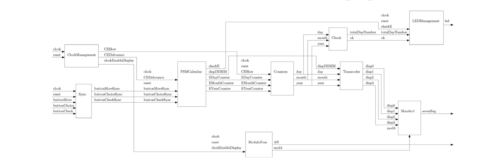

# 💻 Master Camp 2021 - MasterCamper 🔋
## ReadMe Documentation of group 403

This Readme compiles and explains the overall engine and developping process of our 2021 Master Camp project

### Technologies/Hardware used
* <code>Vivado</code>  Compiler/ Debugger / IDE for VHDL to FPGA Workflow
  * Nexys Video 4 => FPGA Card
* <code>MP_Lab</code>  Compiler / Debugger / IDE for C to Microcontroller Workflow
  * Curiosity (PIC 16 F) => Microcontroller Card
* <code>EDA Playground</code>  Online solution to design and VHDL Modules
* <code>Visual Studio Code</code>  IDE of choice for all our code base
* External controllers and displays
  * 4x1 Seven segments display
  * 16x2 LED Display
  * 4x4 Parrallel connection keypad

### Developpement process

Our project has 3 major steps to its completion:

* VHDL/FPGA Programing
* C/Microcontroller Programing
* Plugging everything together 🔌

#### VHDL/FPGA Programing

Thanks to our teachers, we had access to detailed and well explained schematics like this one:


Which allowed us to access the types of portes we had to abstractly create in VHDL like this for instance in the <code>UART_RX</code> module:
```
[...]
ENTITY UART_RX IS
    GENERIC (
        g_CLKS_PER_BIT : INTEGER := 651
    );
    PORT (
        i_Clk : IN STD_LOGIC;
        i_RX_Serial : IN STD_LOGIC;
        o_RX_DV : OUT STD_LOGIC;
        o_RX_Byte : OUT STD_LOGIC_VECTOR(7 DOWNTO 0)
    );
END UART_RX;

[...]
```
Our missions was then to come out with a solution for the processes and behaviors inbetween the different modules:
```
[...]
p_UART_RX : PROCESS (i_Clk)
    BEGIN
        REPORT("p_UART_RX DANS RX");
        IF rising_edge(i_Clk) THEN

            CASE r_SM_Main IS

                WHEN s_Idle =>
                    r_RX_DV <= '0';
                    r_Clk_Count <= 0;
                    r_Bit_Index <= 0;

                    IF r_RX_Data = '0' THEN
                        r_SM_Main <= s_RX_Start_Bit;
                    ELSE
                        r_SM_Main <= s_Idle;
                    END IF;

                    [...]
```

##### FPGA Features

* Recieve/Send information to the <code>MCU</code> through UART Protocol
* Process incoming data by computing <code>day of birth</code> 
* Verifying correspondance between incoming code and Rom memory's code database
* Display incoming data to a 4x1 array of <code>seven segments displays</code>

#### C/Microcotroller Programing

This one was easier to implement thanks our teacher's code base allready implementing approximatly 80% of the project thanks to <code>MPLab Code Configurator</code>

##### MCU Features

* Recieve/Send information to the <code>FPGA</code> through UART Protocol
* Recieve <code>keyPad</code> information through Parallel communication Protocol 
* Display information to the <code>16x2 LED Display</code>
* Delete last character from code if a mistake is made while registering code with the <code>"D" key</code>
* Send code through the <code>"#" key</code>

#### Plugging Everything Together 🔌
That was the easiest part of the project since we only had to follow the teachers direction in order to link everything together

